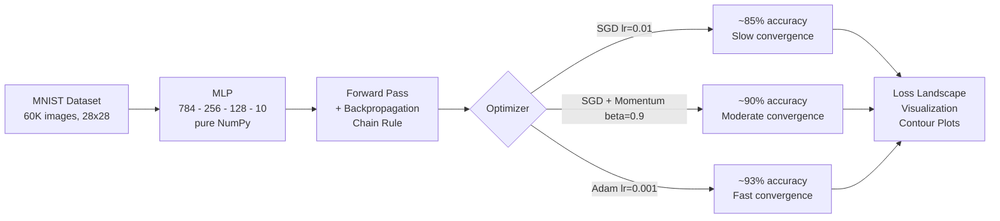

# optimizer-deep-dive

A from-scratch study of **gradient descent, SGD with momentum, and Adam** optimizers — implemented entirely in NumPy with neural network backpropagation and MNIST classification.


## Highlights

| Optimizer | MNIST Test Accuracy | Convergence Speed | Adaptive? |
|-----------|-------------------|-------------------|-----------|
| SGD (lr=0.01) | ~85% | Slow | No |
| SGD + Momentum | ~90% | Moderate | No |
| Adam (lr=0.001) | ~93% | Fast | Yes |

## Training Pipeline



## Project Structure

```
optimizer-deep-dive/
├── src/
│   ├── optimizers.py       # BGD, SGD, Adam + loss functions (pure NumPy)
│   ├── models.py           # Neural network with backpropagation (pure NumPy)
│   └── visualization.py    # Contour plots, loss landscapes, training curves
├── notebooks/
│   └── optimizer_deep_dive.ipynb  # Full study notebook with 11 sections
├── tests/
│   ├── test_optimizers.py  # Optimizer + loss function tests
│   └── test_models.py      # Neural network + activation tests
├── evidence/               # Exported PNG evidence from notebook runs
└── pyproject.toml
```

## Key Concepts

- **Batch Gradient Descent**: Full-dataset gradient, deterministic but slow — convergence rate bounded by condition number κ
- **SGD with Momentum**: Exponential averaging of gradients accelerates through narrow valleys
- **Adam**: Adaptive per-parameter learning rates via bias-corrected first and second moment estimates
- **Backpropagation**: Chain rule applied layer-by-layer to compute gradients efficiently
- **He / Xavier initialization**: Proper weight scaling prevents vanishing/exploding gradients
- **Loss landscape**: 3D visualization of the loss surface around trained solutions

## PDF Report

A fully executed notebook with all outputs is available as a PDF:  
[`notebooks/optimizer_deep_dive.pdf`](notebooks/optimizer_deep_dive.pdf)

## Quick Start

```bash
pip install -e ".[dev]"

# Run tests
python -m pytest tests/ -v

# Open the study notebook
jupyter notebook notebooks/optimizer_deep_dive.ipynb
```

## Requirements

- Python ≥ 3.10
- NumPy ≥ 1.24
- matplotlib, pandas, scikit-learn

**No PyTorch or TensorFlow** — the entire neural network and all optimizers are implemented from scratch in NumPy.

## Author

Chris Schmidt — MS Applied Mathematics | AI Engineering MSE (JHU)

## License

MIT
